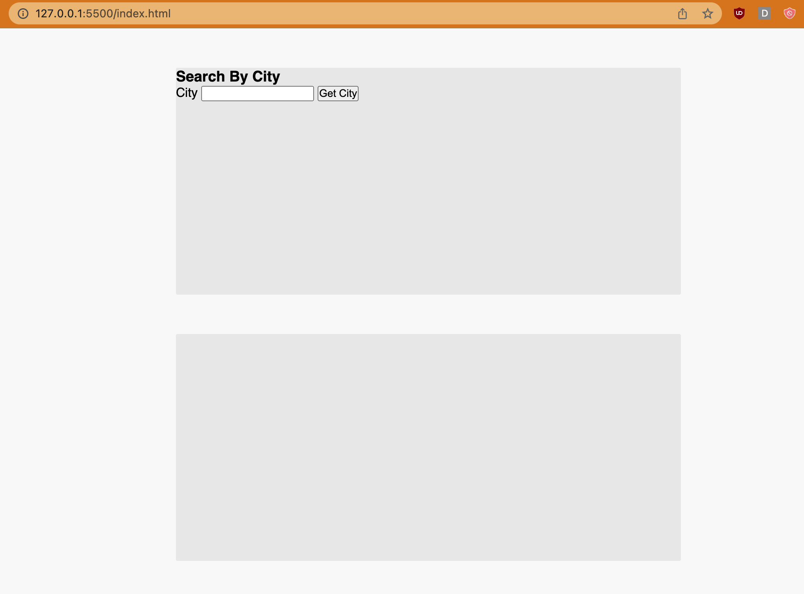

# Server-Side APIs Challenge: Weather Dashboard

## Description

For this project, I attempted to build a a weather dashboard that will run in the browser and feature dynamically updated HTML and CSS.

Using [OpenWeatherMap](https://openweathermap.org/forecast5) the base URL should look like the following: 
```https://api.openweathermap.org/data/2.5/forecast?lat={lat}&lon={lon}&appid={API key}```

I really struggled with this one! And now I'm finding myself in a bit of a time crunch so I'm hoping to submit this project for partial credit. I had so much difficulty with the API. I will re-work this project so I can add it to my portfolio.

## User Story

```
AS A traveler
I WANT to see the weather outlook for multiple cities
SO THAT I can plan a trip accordingly
```

## Acceptance Criteria

```
GIVEN a weather dashboard with form inputs
WHEN I search for a city
THEN I am presented with current and future conditions for that city and that city is added to the search history
WHEN I view current weather conditions for that city
THEN I am presented with the city name, the date, an icon representation of weather conditions, the temperature, the humidity, and the wind speed
WHEN I view future weather conditions for that city
THEN I am presented with a 5-day forecast that displays the date, an icon representation of weather conditions, the temperature, the wind speed, and the humidity
WHEN I click on a city in the search history
THEN I am again presented with current and future conditions for that city
```

## Mockup

Please view my very sad project below. I know it's incomplete but I am hoping to earn as much partial credit as possible.



Below is the mockup from the module assignment:


